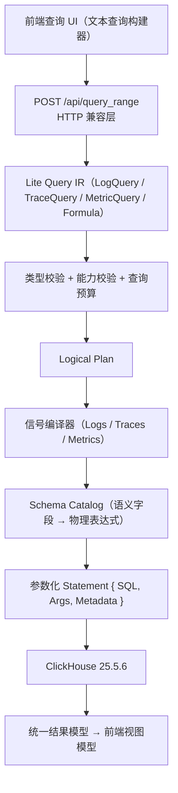
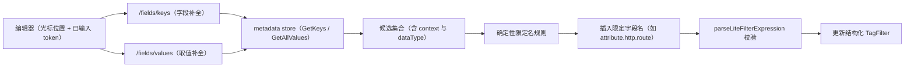

# 轻量级可观测性查询系统的架构设计与边界防御（论文章节）

> 本文档是软件工程硕士论文章节底稿：结合本项目实际代码与设计文档，阐述查询系统的架构、
> 设计、功能边界，并以三个典型查询（Trace / Log / Metrics）演示从前端输入到最终 SQL
> 输出的完整链路，每一步标注处理结果与设计价值。
> 对应代码：`pkg/litequery`、`pkg/querier/liteadapter`、`frontend/src/features/lite-query`。
>
> **说明**：文中查询 API 路径省略版本前缀（统一写作 `POST /api/query_range` 等）；
> SQL 示例中的存储表名已省略存储版本后缀（如 `logs`、`span_index`、`samples`、
> `time_series`），与协议版本无关，特此注明以免误解。

## 1 引言

随着云原生系统规模的增长，可观测性数据（日志、链路、指标）的查询需求日益复杂。通用查询
引擎为了覆盖广泛的分析场景，往往演化出庞大的语法面、复杂的状态管理和隐式的能力扩张，
导致三个系统性问题：**查询语义与存储结构强耦合**（用户概念泄漏到物理表与 SQL 字符串）、
**前后端能力不一致**（界面可构造后端无法执行的查询组合）、**边界模糊**（超出能力范围的
请求被静默降级或产生误导性错误）。

针对上述问题，本章设计并实现了一个轻量级可观测性查询系统。系统以"**受约束、类型安全、
可验证**"为核心设计理念，通过分层架构将查询意图表达、语义解析、SQL 生成与执行解耦，并
建立了一套贯穿前端补全、后端编译与执行的全链路边界防御机制。本章依次阐述系统设计目标与
原则（第 2 节）、总体架构（第 3 节）、核心子系统设计（第 4–7 节）、边界防御机制（第 8
节）、功能边界界定（第 9 节）、端到端查询链路实例（第 10 节）与验证体系（第 11 节），
最后总结（第 12 节）。

## 2 设计目标与设计原则

### 2.1 设计目标

系统面向 Logs、Traces、Metrics 三类遥测信号，需同时满足以下工程目标：

1. **语义独立性**：查询语义不依赖 ClickHouse 表名、列名或 SQL 字符串，存储结构变化不影响
   查询表达；
2. **前端不可越界**：前端无法构造后端不支持的查询组合；
3. **可验证性**：新实现比通用引擎更小、更易测试，并能对超出边界的请求给出**明确拒绝**
   而非静默降级；
4. **兼容演进**：对外 HTTP 协议保持稳定，支持保存查询的受控迁移。

### 2.2 设计原则

归纳为五条贯穿全文的原则：

| 编号 | 原则 | 含义 |
| --- | --- | --- |
| P1 | 能力受约束 | 只实现被真实查询证明需要的能力，语法面保持最小；不支持的能力在 UI 隐藏、在 API 明确拒绝 |
| P2 | 语义与存储解耦 | 查询语义通过 Schema Catalog 与物理存储隔离，编译期禁止 Catalog 之外的字段映射 |
| P3 | 确定性优先 | 字段消歧、结果排序、缺口填充全部采用确定性规则；歧义场景拒绝猜测 |
| P4 | 边界显式化 | 一切越界行为以稳定、可归因的领域错误呈现，禁止静默降级 |
| P5 | 契约共享而非代码共享 | 前后端共享能力矩阵与协议契约，不共享运行时代码 |

## 3 系统总体架构

系统采用"**协议兼容层—语义层—物理层**"三层结构。查询请求自前端发起，经 HTTP 兼容层解码
为与存储无关的中间表示（IR），经类型校验、能力校验与预算校验后生成逻辑计划，由信号编译器
结合 Schema Catalog 生成参数化语句，最后经执行器访问 ClickHouse，并将结果映射回统一响应
模型。整体流水线如图 3-1 所示。



架构的三个关键设计决策：

1. **IR 不包含任何物理信息**：查询意图结构（`QueryRequest` 由 `Range`、`Queries`、
   `Formulas` 组成，`CommonQuery` 声明过滤、分组、排序与限制）中不存在表名、列名或 SQL
   片段，信号差异由类型化的 `LogQuery`/`TraceQuery`/`MetricQuery` 独立表达，避免建立包含
   全部可选字段的巨型通用 DTO。
2. **编译与执行分离**：编译器只负责 SQL 生成，执行器负责超时、并发、扫描、统计、取消与
   错误映射，结果映射器负责格式转换，三者可独立测试。
3. **前后端以能力矩阵为唯一契约源**：机器可读的 `capability-matrix.json` 同时约束前端补全
   集合与后端拒绝策略，任何变更必须同步更新架构决策记录与测试。

## 4 查询语言与中间表示

### 4.1 受约束的过滤器语法

系统定义了公共 Filter AST，其语法面刻意收窄：第一版仅支持**单一扁平 AND 链或单一扁平 OR
链**，混合优先级与括号分组明确拒绝（语法文法由 ANTLR 定义，词法 token 与手写校验层配合，
前端解析与后端编译共用同一语义边界）。支持的谓词分为三类：

- **比较谓词**：`=`、`!=`、`>`、`>=`、`<`、`<=`；
- **集合与存在性谓词**：`IN`、`NOT IN`、`EXISTS`、`NOT EXISTS`；
- **字符串模式谓词**：`CONTAINS`、`NOT CONTAINS`、`LIKE`、`NOT LIKE`、`ILIKE`、`NOT
  ILIKE`、`REGEXP`、`NOT REGEXP`。

字符串模式谓词的设计体现了"受限但不弱"的工程取舍：`CONTAINS` 为大小写不敏感的字面子串
匹配（不解释通配符）；`LIKE`/`ILIKE` 使用 SQL 通配符语义（`%` 匹配任意长度、`_` 匹配单
字符）；`REGEXP` 使用 RE2 兼容模式并在编译 SQL 前预校验。

### 4.2 类型化字面量

系统严格执行"literal 由语法决定类型"：`true` 是布尔，`'true'` 是字符串，禁止字符串到布尔
的隐式强转。该规则从字面量解析（前端 `parseFilterLiteral`）一直贯彻到编译器的类型校验，
保证类型错误在编译期暴露而非运行时产生意外语义。

### 4.3 信号差异的显式化

三类信号在聚合语义上的差异被显式建模而非隐藏在一个通用聚合器之后：

- **Logs**：支持原始日志列表与 offset 分页、按时间桶与属性分组的 count/sum/avg/min/max、
  时间序列/标量/原始三类结果；
- **Traces**：支持 span/trace 列表、按 trace 聚合、count 与 duration 的 avg/p50/p90/p95/p99
  分位数、trace 类型结果；trace scope（根/入口）语义由编译器唯一展开；
- **Metrics**：按类型约束操作面——Gauge 支持 latest/avg/min/max，Sum 支持
  sum/rate/increase，显式 Histogram 支持 p50/p90/p95/p99 分位；内部采用"时间聚合后按标签
  聚合"的两阶段计划，但该计划是 `MetricPlan` 的明确语义，不对外暴露为通用二次聚合。

## 5 Schema Catalog 与字段元数据消歧

### 5.1 Schema Catalog 的隔离作用

Schema Catalog 是查询语义与 ClickHouse schema 之间的**唯一接口层**。每个语义字段
（`SemanticField`）声明信号、名称、类型、物理表达式、可用操作符集合及可选择性，编译器
不得在 Catalog 之外散落任何字段到列的映射。存储结构变化（表改名、列迁移、物化列引入）
只影响 Catalog，不触及查询语义层——这直接支撑设计目标 1。

### 5.2 字段携带方式的歧义问题

查询请求中的字段存在两种携带方式：**结构化字段**（`selectFields`、`groupBy`、`order`）携带
完整的上下文与数据类型；**文本筛选表达式**中的字段可能只携带名称（如 `host.name`），缺失
上下文与类型。若对裸字段名采用"常见字段白名单"式硬编码推断，必然与真实数据字段漂移，
产生持续的漏项与误导性错误。为此系统设计了**字段元数据消歧契约**。

### 5.3 应用边界消歧、核心保持确定性

消歧机制的关键架构决策是**位置约束**：metadata 查询只发生在应用边界（适配层），SQL
编译核心不依赖任何 metadata 存储，metadata 以纯数据结构注入适配器，保证核心编译器的确定性
与可测试性（满足依赖纯净性约束）。具体流程为：

```text
查询请求
  → FieldKeySelectors：批量收集上下文/类型不完整的字段
      （filter 文本 token、select/group/order 字段、日志聚合内层字段）
  → metadata store 批量查询（GetKeysMulti）
  → MetricMetadata.FieldKeys 以纯数据注入适配器
  → resolveFieldMetadata 按序消歧
  → FieldRef { Name, Context, Type } 进入 Lite IR
```

消歧规则按优先级执行（表 5-1），其设计权衡在于"**尽可能确定、必要时拒绝**"：

| 优先级 | 规则 | 设计动机 |
| --- | --- | --- |
| 1 | 固有字段静态解析 | 命中信号固有字段表时无需查询 metadata，显式类型只校验 schema，不能把固有字段降级为动态属性 |
| 2 | 显式上下文/类型优先 | 用户显式指定时 metadata 只在约束内匹配，不覆盖显式值 |
| 3 | 类型与回退匹配 | 未指定类型时优先选择与操作符推断类型一致的候选，避免数值操作误选字符串存储 |
| 4 | 裸名 resource 优先 | 同名 resource/attribute 候选并存时选择 resource，保持既有行为兼容 |
| 5 | 存储类型约束 | resource map 只存字符串，未登记的数字/布尔裸字段可确定性解析为 attribute |
| 6 | 唯一候选才消歧 | 多候选歧义时不猜测，交由编译校验给出明确错误 |

该契约的工程价值在于：消歧结果**可归因、可测试**——每个错误都能追溯到规则序号；无
metadata 存储的测试环境通过注入构造数据保持确定性；告警执行、实时日志与面板查询共用同一
套解析规则，避免同名字段在不同路径下语义漂移。

## 6 编译器、执行器与查询预算

### 6.1 参数化语句契约

编译器输出统一为参数化语句（`Statement { SQL, Args, Metadata }`）：所有用户值（含模式
谓词的 pattern）一律通过位置参数传递，任何 SQL 片段均被拒绝为输入。该契约从结构上消除
SQL 注入面，同时使语句可在 ClickHouse 25.5.6 上以真实 schema 复现执行。

### 6.2 编译与执行的责任划分

- **编译器**：负责 SQL 生成，包括时间范围条件、时间桶表达式、聚合函数与存在性语义（如
  Map 字段比较前先做存在性检查）；
- **执行器**：负责超时控制、并发执行、结果行扫描、统计与取消传播，对每条语句默认最多
  扫描 250,000 个结果行，超限即关闭 rows 并返回预算错误——行预算保护应用进程，但不替代
  存储侧的扫描预算，二者边界在文档中显式声明；
- **结果映射器**：负责时间序列点稳定排序、非有限数处理（时间序列剔除、标量转 `null`）与
  缺口填充（`fillGaps` 作为结果层规则，按 epoch 对齐桶、严格使用半开区间 `[start, end)`）。

### 6.3 查询预算体系

系统建立了多维预算：单条时间序列最大 11,000 个时间点、单语句最大 250,000 结果行、最大
raw/trace limit、最大分组数、最大过滤器 AST 深度与节点数、单请求最大独立查询数。预算拒绝
返回**稳定的领域错误**与可操作信息。特别地，时间序列的非零 `limit` 被明确拒绝——直接
应用 `LIMIT` 会截断时间桶而非选择 Top-N 序列，真正语义需要"先选序列、再读完整时间桶"的
两阶段计划，在该计划落地前不提供该能力。这体现了原则 P1"能力受约束"与 P4"边界显式化"
的统一：**不提供比正确实现更弱的近似能力**。

### 6.4 正确性不变量

针对审计发现的"无 SQL 错误但结果错误"类风险，系统固化了正确性不变量（架构决策记录
ADR-016），代表性设计包括：

1. **Trace 汇总三步执行**：先匹配 trace ID，再读取时间范围内完整 span，最后生成统计与
   代表 span——代表 span 优先最长根 span，根缺失时回退最长 span；span 计数为完整 trace 的
   span 数，duration 为代表 span 的时长而非求和。该设计保证命中子 span 过滤的 trace 仍能
   展示根信息，且部分/孤儿 trace 不被静默丢弃；
2. **公式对齐协议**：命名查询间公式（`+ - * /`）要求相同的时间戳/分组列 schema，对齐键
   采用长度前缀与运行时类型编码，缺失对齐值以零参与并产生警告；
3. **直方图 temporality 契约**：Delta 点在查询桶内求和，Cumulative 点取最新快照并跨桶
   求差，禁止默认伪装为 Cumulative；
4. **Trace 原始结果强制投影身份字段**：`timestamp`、`trace_id`、`span_id` 作为跳转所需的
   传输身份无条件输出，前端不得把缺失值序列化为无效链接。

## 7 前端查询构建器与自动补全

### 7.1 单一文本表达式模型

查询输入组件（文本查询构建器）采用**始终编辑一条文本表达式**的模型，不再把已输入
条件转为 chip/tag。该模型的优势在于：表达式是唯一的权威输入，避免了多形态状态（chips、
文本、结构化）之间的同步漂移——历史实现曾因维护多套并行的字段限定、操作符、值类型与校验
规则，导致同一字段在不同页面呈现不同的限定名与语义。

### 7.2 能力矩阵驱动的补全管线

自动补全并非自由文本联想，而是**由后端能力矩阵与 metadata 联合约束的确定性插入**。补全
管线如图 7-1 所示：



关键设计决策：

1. **补全只展示能力矩阵允许的集合**：操作符候选按字段类型收窄（如 `isRoot`、
   `isEntryPoint` 只允许 `= true`），从源头杜绝前端补全出后端拒绝的查询；
2. **候选项必须插入限定字段名**：优先应用少量稳定语义映射（`http.route →
   attribute.http.route`、`service.name → resource.service.name`、`host.name →
   resource.host.name`），其余字段使用服务端 metadata 返回的 context。这样旧 metadata 中
   同名的物化列/目录项不会制造两个不同限定名，保证补全结果的确定性；
3. **显示层与结构层分离**：显示名 `attribute.http.route` 解析为结构化字段 `{key:
   "http.route", type: "attribute", dataType: "string"}`，限定前缀不残留在 raw key 中；
4. **草稿与提交分离**：不完整或非法的表达式草稿只保存在编辑器内，只有通过
   `parseLiteFilterExpression` 校验的完整表达式才更新结构化查询状态。

### 7.3 表达式与结构化状态的双向同步

前端同时维护结构化过滤项（`filters.items`）与文本表达式（`filter.expression`），二者的
同步规则是状态正确性的关键：结构化项变更后必须同步生成 `span.*`/`resource.*`/`attribute.*`
限定名写入表达式，防止 URL 中的旧文本覆盖最新 UI 状态；表达式合并以**规范化字段身份**
匹配结构化字段与文本谓词——`service.name`（resource 上下文）与 `resource.service.name`
被视为同一字段更新同一谓词，而字段、操作符或值任一不同的谓词不会被静默合并，只有完全
等价的历史重复项在安全去重中被移除。

## 8 边界防御机制

边界防御是系统的横向关注点，贯穿前端、协议层、编译层与执行层，形成四道防线：

**第一道：前端能力校验（UI 层）**。前端公式能力校验与后端共用同一语法边界：名称、十进制
常量、括号与 `+ - * /`；函数、一元运算与除零均拒绝。合法常量公式不会被 UI 误判，保证
"前端无法构造后端不支持的查询组合"（设计目标 2）。

**第二道：协议层显式拒绝（兼容边界）**。HTTP 兼容层对旧保存查询中不支持的子集给出确定的
"不支持"错误，不做静默降级；过渡期内部能力协商（feature flag）不成为公开协议的一部分。
不透明游标被拒绝，实时日志使用独立的类型化 `(timestamp, id)` 游标契约。

**第三道：编译期防御（语义层）**。类型校验、能力校验与预算校验在编译前完成；正则表达式
在 Go 侧先按 RE2 编译预校验，pattern 最长 1,024 字节；字符串模式谓词仅允许 string 字段。
编译器是 trace scope（根/入口）语义的唯一展开点，前端不得改写为物理列。

**第四道：执行期防御（物理层）**。行预算、超时与取消、ClickHouse 错误映射构成执行期防线。
执行超时使用独立的领域超时分类，映射为标准超时错误而非伪装成"不支持"或"输入非法"；调用
方取消透传 `context.Canceled`，保证错误归因准确。

此外，错误分类学贯穿四道防线：`invalid-input`（输入非法）、`unsupported`（能力越界）、
`budget-exceeded`（预算超限）、`timeout`（执行超时）被严格区分，任何一层都不允许将一类
错误伪装成另一类。

## 9 功能边界与专用读取体系

### 9.1 边界界定原则

系统明确拒绝以下能力：通用 join/子查询、用户输入 SQL、通用二次聚合、任意 Having DSL、
通用函数链（异常检测、EWMA、中位数、累计和等）与 PromQL 重实现。拒绝逻辑遵循同一判据：
**能力是否被真实查询证明需要、语义是否可确定性表达**。历史上曾存在一个将面板 DSL 编译为
SQL 的大型通用编译器，其面板查询能力由本系统接管，而跨 span 关系等无法确定性表达的能力
被**显式拒绝而非迁移**——这确立了"能进能力矩阵的整合、进不了的显式拒绝"的决策标准。

### 9.2 专用读取 API 的保留

系统保留了一批专用读取 API（多步漏斗、服务依赖图、trace 详情、异常分组、实时日志、告警
状态历史等），它们不经过统一编译链路，而是以固定 SQL 模板或参数化语句直接读取存储。保留
依据归纳为四点：

1. **语义形态不同**：多步漏斗的顺序匹配是跨 span 时序语义，需要将多个步骤整体规划，超出
   单查询能力矩阵；单点寻址（trace_id）、游标推进（异常分页）、持续输出（SSE 流）不属于
   查询编译范畴；
2. **读取对象不同**：专用读取多针对预聚合表、元数据表与状态表，统一 Schema Catalog 只
   覆盖三类信号主表；
3. **复杂度不对称**：固定输入/输出形状用参数化模板比编译链路更简单、更可审计，DSL→IR→
   Planner 的复杂度只对"任意查询"值得；
4. **复用策略**：对专用模块采取"**能复用的部分复用、执行形态保持专用**"——多步漏斗的
   每步过滤子句复用公共过滤器语法，实时日志的过滤表达式复用统一解析器，但多步计算与流式
   执行保持专用实现。

## 10 端到端查询链路实例

本节以三个典型查询演示从用户输入到最终 SQL 输出的完整链路。三者的共同特征：**每一层都
只做自己职责内的事，且每一层的结果都可以被单独验证**——这正是第 3 节分层架构的价值所在。

### 10.1 Trace 查询：按服务分组的 P95 延迟时间序列

**场景**：用户在 Traces Explorer 中查看最近 60 秒各服务的 P95 延迟曲线，并过滤只关注
`api` 服务的调用。

**步骤 1：前端输入与校验**。用户在文本框中输入过滤条件，补全服务插入限定名：

```text
resource.service.name = 'api'
```

前端 `parseLiteFilterExpression` 解析为结构化 `TagFilter`，操作符 `=` 经字段类型校验合法；
同时该表达式通过 `toLiteFilterExpression` 与结构化 `filters.items` 保持同步（7.3 节）。

> **价值**：类型化字面量与限定名补全在输入时刻就消除了"`api` 是字符串还是别的类型"、
> "`service.name` 属于哪个上下文"两类歧义；用户永远看不到裸字段名。

**步骤 2：查询请求**。前端构造 `POST /api/query_range` 请求：

```json
{
  "start": 1720000000000, "end": 1720000060000, "step": 1000,
  "compositeQuery": {
    "queryType": "builder",
    "builderQueries": {
      "A": {
        "queryName": "latency",
        "stepInterval": 1000,
        "dataSource": "traces",
        "aggregateOperator": "p95",
        "aggregateAttribute": {"key": "duration_nano", "dataType": "float64", "type": "span"},
        "filters": {"op": "AND", "items": [
          {"key": {"key": "service.name", "dataType": "string", "type": "resource"},
           "op": "=", "value": "api"}
        ]},
        "groupBy": [{"key": "service.name", "dataType": "string", "type": "resource"}],
        "expression": "resource.service.name = 'api'"
      }
    },
    "formulas": {"F1": {"formula": "A"}}
  },
  "formatOptions": {"fillGaps": true}
}
```

> **价值**：请求在 HTTP 层与旧协议完全兼容，保存查询可无缝迁移；`aggregateOperator: p95`
> 是受限枚举，未知枚举值在解码层即被拒绝。

**步骤 3：适配层字段消歧**。`liteadapter.FieldKeySelectors` 遍历请求发现字段均携带完整
上下文（`resource` + `string`），metadata 查询结果为空；结构化字段直接进入 IR。

> **价值**：结构化字段"免消歧"路径证明消歧机制（第 5 节）只在必要时介入——带上下文的
> 字段零开销通过，裸字段才触发 metadata 批量查询。

**步骤 4：IR 与计划**。适配层输出类型化 IR：

```go
TraceQuery{
  Common: CommonQuery{
    Name: "latency",
    Filter: Predicate{Field: {Name: "service.name", Context: Resource, Type: String},
                      Op: FilterEqual, Value: "api"},
    GroupBy: [FieldRef{Name: "service.name", Context: Resource, Type: String}],
  },
  Aggregation: TraceAggregateDurationP95,
}
```

`DefaultPlanner` 校验后生成时间序列计划：`ResultTimeSeries`、`StepMS=1000`、时间桶表达式
按信号选择（Traces 为毫秒时间戳 `intDiv(toUnixTimestamp64Milli(ts), step) * step`）。

> **价值**：IR 不含任何物理信息——`service.name` 此时仍是语义字段，后续换表、换列不影响
> 本层；计划层同时完成能力校验（p95 对 traces 合法）与预算校验（step 合理、点数不超上限）。

**步骤 5：Catalog 解析与编译**。Catalog 将 `service.name`（resource）解析为物理列
`` `resource_string_service$$name` ``（物化列，走 M9 物化加速路径），`duration_nano` 为
span 固有列；编译器生成参数化语句（实际测试断言）：

```sql
SELECT intDiv(toUnixTimestamp64Milli(siginsight_traces.span_index.timestamp), ?) * ? AS timestamp,
       `resource_string_service$$name` AS group_0,
       quantile(0.95)(duration_nano) AS value
FROM siginsight_traces.span_index
WHERE siginsight_traces.span_index.timestamp >= fromUnixTimestamp64Milli(?)
  AND siginsight_traces.span_index.timestamp < fromUnixTimestamp64Milli(?)
GROUP BY intDiv(toUnixTimestamp64Milli(siginsight_traces.span_index.timestamp), ?) * ?,
         `resource_string_service$$name`
ORDER BY timestamp ASC
-- Args: [1000, 1000, 1000, 61000, 1000, 1000]
```

若过滤条件命中带存在性语义的 Map 字段，编译器会追加
`((`resource_string_service$$name_exists`) AND (...))` 存在性前置（此处为物化列，直接
比较即可）。

> **价值**：①所有值走 `?` 占位符，注入面为零（ADR-004）；②时间条件限定在
> `[start, end)` 半开区间，与结果层 `fillGaps` 同一套区间约定；③分组表达式与 SELECT
> 表达式完全一致，避免 ClickHouse 别名解析歧义；④`quantile(0.95)` 由
> `TraceAggregateDurationP95` 枚举确定性映射，不存在用户可注入的聚合名。

**步骤 6：执行与结果映射**。执行器并发执行（限 250,000 行预算），结果映射器按
`timestamp` 稳定升序排列各 series 点，`fillGaps` 在 `[start, end)` 内补零，非有限数不进入
时间序列。返回统一结果：

```json
{"status": "success", "data": {
  "resultType": "time_series",
  "result": [{"metric": {"service.name": "api"}, "values": [[1720000000, 152.3], ...]}]
}}
```

**步骤 7：前端渲染**。时间序列图直接消费统一结果模型，图表栈复用既有可视化。

> **价值**：稳定排序 + 补零使图表不依赖 SQL 返回顺序（ADR-016 不变量 3），同一查询在任何
> 执行计划下渲染一致。

### 10.2 Log 查询：带 JSON 路径提取的原始日志列表

**场景**：用户在 Logs Explorer 中查看 `api` 服务的原始日志，并展示每条日志中 JSON 正文
的 `request.id` 字段，每页 25 条。

**步骤 1：前端输入**。用户输入 `resource.service.name = 'api'`，并在字段选择中选择
`request.id`（body 上下文）。补全将其限定为 `body.request.id` 语义（body JSON path）。

**步骤 2：查询请求**（核心部分）：

```json
{
  "builderQueries": {
    "A": {
      "dataSource": "logs",
      "aggregateOperator": "noop",
      "selectFields": [
        {"key": "timestamp", "dataType": "int64", "type": "log"},
        {"key": "request.id", "dataType": "string", "type": "body"}
      ],
      "filters": {"op": "AND", "items": [
        {"key": {"key": "service.name", "dataType": "string", "type": "resource"},
         "op": "=", "value": "api"}
      ]},
      "limit": 25
    }
  }
}
```

**步骤 3：适配层**。`selectFields` 中的 `request.id`（body）被识别为日志聚合/选择字段，
直接映射为 IR 的 `Select`；filter 消歧同上。

**步骤 4：IR**：

```go
LogQuery{
  Common: CommonQuery{
    Name: "logs",
    Select: [FieldRef{Name: "timestamp", Context: Log, Type: Number},
             FieldRef{Name: "request.id", Context: Body, Type: String}],
    Filter: Predicate{Field: {Name: "service.name", Context: Resource, Type: String},
                      Op: FilterEqual, Value: "api"},
    Limit: 25,
  },
  Aggregation: LogAggregateCount,  // noop 原样输出
}
```

**步骤 5：编译**。Catalog 对 body 字段生成 `JSON_VALUE(body, ?)` 参数化 JSON path，对
resource map 生成存在性前置，日志时间戳按纳秒 UInt64 处理（实际测试断言）：

```sql
SELECT timestamp AS field_0, JSON_VALUE(body, ?) AS field_1
FROM siginsight_logs.logs
WHERE (siginsight_logs.logs.timestamp >= toUInt64(?)
       AND siginsight_logs.logs.timestamp < toUInt64(?))
  AND ((mapContains(resources_string, ?)) AND (resources_string[?] = ?))
ORDER BY timestamp DESC, id DESC LIMIT ?
-- Args: ["$.request.id", 1000000000, 2000000000, "service.name", "service.name", "api", 26]
```

> **价值**：①Logs 与 Traces 的时间戳物理类型不同（UInt64 纳秒 vs DateTime64），时间条件
> 由 Catalog 按信号选择正确的转换——这正是"Catalog 是唯一映射点"的体现；②`mapContains`
> 存在性前置保证"没有该 resource 键的日志"不会因缺失比较被误判为匹配/不匹配，语义精确；
> ③`LIMIT 26 = 25 + 1`：多取一行用于探测"是否还有下一页"，支持 offset 分页的稳定性；
> ④`ORDER BY timestamp DESC, id DESC` 的 `id` 是物理 tie-breaker，保证同时间戳日志顺序
> 确定，分页不重不漏。

**步骤 6：执行与映射**。结果映射器按列名恢复字段（`field_0` → `timestamp`、
`field_1` → `request.id`），统一结果返回原始行列表。前端表格渲染，点击行可携带
`trace_id` 跳转 Trace Detail。

### 10.3 Metrics 查询：Counter 的 rate 时间序列

**场景**：用户查看 `http.server.request.count` 在最近 60 秒的请求速率（rate），按服务
分组。

**步骤 1：前端输入**。用户在 Metrics Explorer 选择 metric，配置 `rate` 时间聚合 +
`sum` 空间聚合 + group by `service.name`。前端能力矩阵校验：rate 只对 Sum 类型合法。

**步骤 2：查询请求**（核心部分）：

```json
{
  "builderQueries": {
    "A": {
      "dataSource": "metrics",
      "aggregateOperator": "rate",
      "aggregateAttribute": {"key": "http.server.request.count", "dataType": "float64", "type": "metric"},
      "timeAggregation": "rate", "spaceAggregation": "sum",
      "groupBy": [{"key": "service.name", "dataType": "string", "type": "resource"}]
    }
  }
}
```

**步骤 3：适配层**。metric 字段解析走 `MetricMetadata` 注入：`http.server.request.count`
的 temporality（Delta/Cumulative）从 metadata 解析，随 IR 传入编译器——这决定 rate 的
计算方式（见步骤 5）。

**步骤 4：IR**：

```go
MetricQuery{
  Common: CommonQuery{Name: "A", GroupBy: [FieldRef{Name: "service.name", Context: Resource, Type: String}]},
  MetricName: "http.server.request.count",
  Type: MetricSum, TimeAggregation: TimeAggregateRate, SpaceAggregation: SpaceAggregateSum,
  Temporality: TemporalityCumulative,  // 由 metadata 注入
}
```

**步骤 5：编译**。Metrics 编译器输出**显式双阶段** SQL（`metric_compiler.go` 的设计核心：
"first CTE owns one value per fingerprint and bucket; the final SELECT only aggregates"）：

```sql
WITH
  -- 阶段一：series 选择。按标签过滤/分组匹配的 series 集合（fingerprint → 标签）。
  __lite_series AS (
    SELECT fingerprint, `resource_string_service$$name` AS group_0
    FROM siginsight_metrics.time_series
    WHERE metric_name = ?
    GROUP BY fingerprint, `resource_string_service$$name`
  ),
  -- 阶段二：时间桶内每 series 一个值（此处为求和，若为 counter 则取窗口聚合）。
  __lite_bucketed AS (
    SELECT points.fingerprint,
           intDiv(points.unix_milli, ?) * ? AS timestamp,
           series.group_0,
           sum(points.value) AS bucket_value
    FROM siginsight_metrics.samples AS points
    INNER JOIN __lite_series AS series ON points.fingerprint = series.fingerprint
    WHERE points.metric_name = ? AND lower(points.temporality) = lower(?)
      AND points.unix_milli >= ? AND points.unix_milli < ?
    GROUP BY points.fingerprint, timestamp, series.group_0
  ),
  -- 阶段三：rate 语义。Cumulative counter 用窗口差分：相邻桶差值 / 时间差。
  __lite_temporal AS (
    SELECT fingerprint, timestamp, group_0,
           if(row_number() OVER counter_window = 1, NULL,
              (bucket_value - lagInFrame(bucket_value, 1) OVER counter_window)
              / ((timestamp - lagInFrame(timestamp, 1) OVER counter_window) / 1000.0))
           AS per_series_value
    FROM __lite_bucketed
    WINDOW counter_window AS (PARTITION BY fingerprint ORDER BY timestamp)
  )
SELECT timestamp, group_0, sum(per_series_value) AS value
FROM __lite_temporal
GROUP BY timestamp, group_0
ORDER BY timestamp ASC
```

> **价值**：①**两阶段显式化**：series 选择（`time_series`）与点数读取（`samples`）
> 分离，第一阶段用小表收敛维度，第二阶段只扫描命中 series 的点——这是 Metric 查询区别于
> 通用 join 的确定性计划（ADR-005）；②**temporality 决定 rate 语义**：Cumulative 用
> `lagInFrame` 相邻桶差分（且首桶为 `NULL`，不产生虚假速率），Delta 直接
> `bucket_value / step`——同一 `rate` 关键字因 metadata 注入的 temporality 编译出不同的
> 正确语义，杜绝"把 cumulative 伪装成 delta"的错误（ADR-016 不变量 7）；③窗口函数
> `PARTITION BY fingerprint ORDER BY timestamp` 保证每个 series 独立、按时间有序差分。

**步骤 6：执行与映射**。执行器扫描上限保护；结果映射器同样按 `timestamp` 稳定排序、
`fillGaps` 补零。`NULL` 首桶在标量聚合中被正确忽略，时间序列中不产生 0 值假象。

**步骤 7：前端渲染**。速率曲线图。

### 10.4 三条链路的横向对照

| 维度 | Trace 示例 | Log 示例 | Metrics 示例 |
| --- | --- | --- | --- |
| 前端输入形态 | 限定名文本 + 聚合下拉 | 限定名文本 + 字段选择 | metric 选择 + 聚合配置 |
| 消歧介入 | 无（字段带上下文） | 无（字段带上下文） | temporality 由 metadata 注入 |
| 时间戳物理类型 | DateTime64（毫秒语义） | UInt64 纳秒 | unix_milli（毫秒） |
| 过滤存在性语义 | 物化列直接比较 | `mapContains` 前置 | series 表先行匹配 |
| 聚合编译 | 单阶段 `quantile(0.95)` | 原样输出 + JSON path | 三 CTE 双阶段 + 窗口差分 |
| 关键正确性机制 | 半开区间、表达式一致 | limit+1、id tie-breaker | temporality 决定 rate 语义 |

**共性结论**：三条链路共享同一套分层（输入校验 → 协议 → 消歧 → IR → 计划 → Catalog
编译 → 参数化执行 → 结果映射），差异全部被封装在 Catalog 与信号编译器中。读者可以从中
看到：**查询语义的差异是"数据模型差异"的投影，而非引擎能力的差异**——这正是"一个受约束
的引擎 + 一组显式信号语义"能够同时满足 P1（能力受约束）与 P2（语义与存储解耦）的原因。

## 11 验证体系

系统的验证采用"单元—集成—端到端"三级体系，与变更规则联动（每个里程碑必须有设计、测试
计划与退出条件）：

| 层级 | 范围 | 证据 |
| --- | --- | --- |
| 单元测试 | 编译器（参数化 SQL、存在性语义、scope 展开）、适配器（确定性序列化、点排序、缺口填充）、前端纯函数（补全限定、光标阶段、类型化操作符、literal 转义） | `go test` 全量通过；前端 Jest 285 套件、2,772 用例通过 |
| 集成测试 | ClickHouse 25.5.6 真实 schema 执行全部生成 SQL（含 ILIKE、REGEXP、NOT LIKE 与 trace scope 查询） | 集成编译器测试通过 |
| 端到端 | 当前采集器在真实存储上执行 schema 迁移，经 OTLP 写入三类信号，再由认证查询 API 读回；物理表的查询日志均无错误 | 跨仓库协作脚本通过 |
| 前端回归 | 主要页面真实浏览器验证只渲染新构建器，限定名补全正确，真实查询返回 HTTP 200 | Playwright 回归通过 |

第 10 节展示的三条链路 SQL 均来自编译器单元测试的真实断言，可直接作为"设计与实现一致"
的证据链。

## 12 本章小结

本章设计并实现了面向三类信号遥测数据的轻量级查询系统。系统的核心贡献可归纳为三点：
**其一**，以 Schema Catalog 与中间表示实现查询语义与物理存储的彻底解耦，使编译器保持
确定性且可独立测试；**其二**，以"应用边界消歧、核心保持确定性"的契约解决文本表达式的
字段歧义问题，消歧结果可归因、可测试；**其三**，建立贯穿前端补全、协议层、编译层与执行
层的四道边界防御，配合多维查询预算与严格错误分类，使系统"明确拒绝"而非"静默降级"。三个
端到端查询实例进一步表明，差异化的信号语义（时间戳类型、聚合形状、temporality）全部收敛
于 Catalog 与信号编译器，查询链路每一层职责单一、结果可独立验证。验证结果表明，系统在
保持既有查询能力的同时实现了代码规模收敛，验证了"能力受约束、边界显式化"设计理念的工程
可行性。
